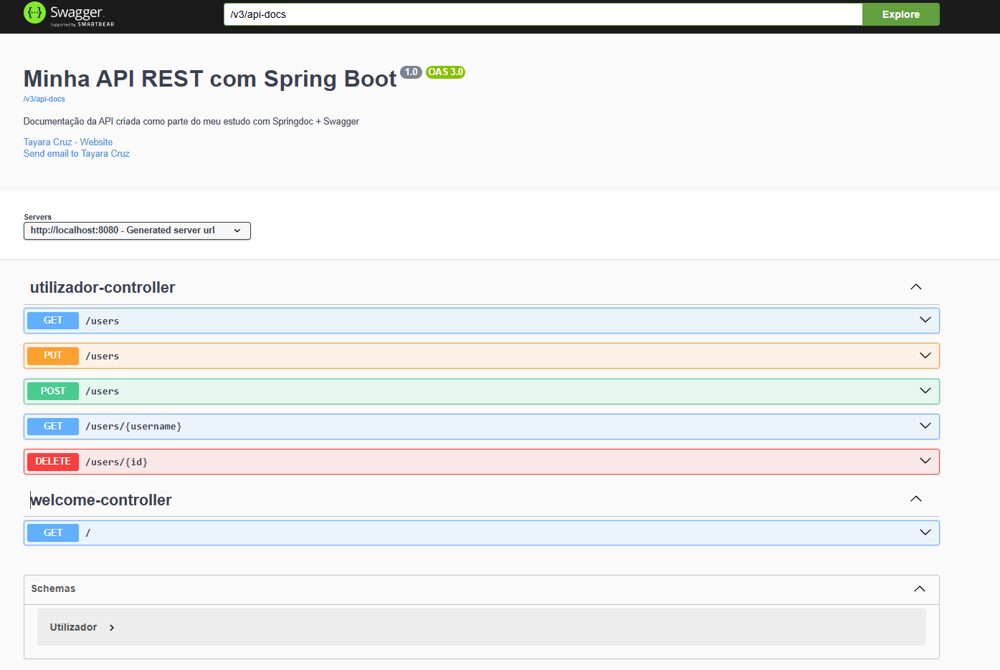

# 🚀 Projeto: API REST com Spring Boot - Bradesco Java Cloud Native (DIO)

Este projeto foi desenvolvido como parte do bootcamp **Bradesco - Java Cloud Native** na plataforma **DIO (Digital Innovation One)**.

O objetivo foi criar uma **API REST** utilizando Spring Boot, com persistência de dados e documentação automática utilizando **Swagger (Springdoc OpenAPI)**.

---

## 📚 Tecnologias Utilizadas

- Java 24
- Spring Boot 3.x
- Spring Web
- Spring Data JPA
- Springdoc OpenAPI (Swagger 3)
- Maven

---

## 🛠️ Funcionalidades da API

- Cadastro de utilizadores (`User`)
- Listagem de todos os utilizadores
- Persistência com JPA
- Documentação automática com Swagger

---

## 📄 Documentação com Swagger

A documentação da API foi gerada automaticamente com Springdoc OpenAPI.

🖼️ **Print da documentação:**

---

## 👩‍💻 Desenvolvido por

**Tayara Cruz**

